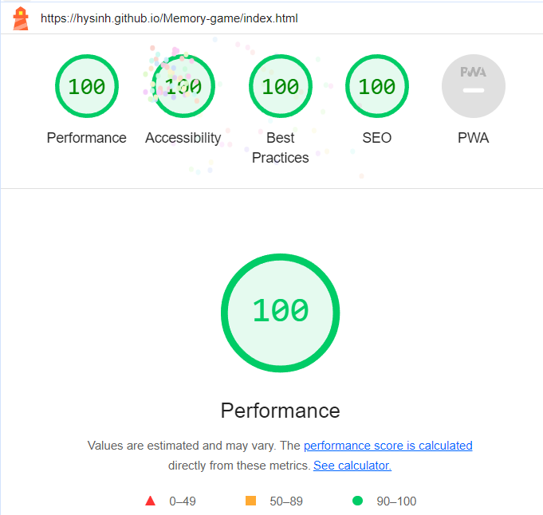

# Happy Cake Friends Memory Game
  

  [View Live Project Here](https://hysinh.github.io/Memory-game/)

## Introduction
The Happy Cake Friends Memory Game is a simple, fun online game for all ages.

## CONTENTS  
  
* [User Experience)](#user-experience)
  * [User Stories](#user-stories) 
* [Design](#design)
  * [Site Design](#site-design)
  * [Wireframes](#wireframes)
  * [Colour Scheme](#colour)
  * [Typography](#typography)
* [Features](#features)
  * [Card Grid](#card-grid)
  * [Play Button](#play-button)
  * [Player Tries Remaining](#player-tries-remaining)
  * [Footer](#footer)  
  * [Favicon](#favicon)  
* [Future Features](#future-features)
* [Technologies](#technologies)
  * [Languages Used](#languages-used)
  * [Technologies and Programs Used](#technologies-and-programs-used)
  * [Deployment](#deployment)
* [Testing](#testing)
  * [HTML Validation](#html-validation)
  * [CSS Validationn](#css-validation)
  * [Lighthouse Performance Audits via Chrome Dev Tools](#lighthouse-performace-audit-via-chrome-dev-tools)
  * [Manual Testing](#manual-testing)
  * [Bugs and Fixes](#bugs-and-fixes)
  * [Unfixed Bugs](#unfixed-bugs)
* [Credits](#credits) 

  
---   

## User Experience
Memory Gamezz ux stories
- ### Visitor Goal
  Happy Cake Friends visitors can range in age and genger but they are all generally looking for a simple, online game to entertain them featuring the cute Cake Friends characters. The website offers a short reprieve from the cares of daily life and offer entertainment via a mentally challenging memory exercise.
- ### User stories
  1. User looking to play a simple game while waiting for public transport.
  2. User looking for a simple memory game to play while waiting (e.g. waiting at the GP office or riding the bus).
  3. User is a child with a parent who needs them to be occupied with a simple, safe and entertaining memory game that can be played quietly for a period of time. 
  4. User is a fan of the Happy Cake Friends and enjoys playing games or interacting with the Happy Cake Friends brand.

## Design

- #### Site design 
  For a simple, online game, the Happy Cake Friends has a colorful, illustrated look that appeals to those who enjoy a cute, illustrated aesthetic or are fans of the Happy Cake Friends characters or brand.

  The Happy Cake Friends website needed to be responsive and available on a variety of screen sizes and devices to make it as accessible as possible. I focused on the following sizes:

  1. Mobile Device dimensions (small): 280px x 653px
  2. Mobile Device dimensions (larger): 375px and larger
  3. Tablet Device dimensions: 736px and larger

- #### Wireframes
  The Happy Cake Friends website was designed by wireframes with pencil and paper. After sketching out what I planned, I started laying out the HTML and basic CSS for the site in a similar way that the Love Maths tutorial went. I made a list of the functions that I thought that the game would need and proceeded from there.

  

  
Mobile Wireframes
  

  
  
 

  

  
Tablet Wireframes
  

  
  
    

  

  
Desktop Wireframes
  

  
  
    
- #### Colour 
  
  The Happy Cake Friends color palette is bright, fresh, and youthful and suits the illustractor Cake Friends characters.
   
   
  Initially, my buttons featured white text and this, in combination with the orange background, failed the acceptable [WCAG](https://www.w3.org/WAI/WCAG21/Understanding/contrast-minimum.html) contrast ratio. Ultimately, I chose to change the text color to the same color as the rest of the website's font color to ensure readability and accessibility. I used the [Adobe Color](https://color.adobe.com/create/color-contrast-analyzer) to test the colors.

  
- #### Typography
  The Happy Cake Friends logo is using the Londrina Solid font family. It offers a cartoon style that works well with the illustrated, cartoon aesthetic of the Happy Cake Friends.

  The font family is Poppins. It was chosen for it's clean look, readability, and variety of weights.

  

## Features
### Card Grid

  

  
The Navigation Bar is featured on all five pages of the website. The full responsive navigation bar includes links to the Logo, About page, Menu Page, Our Cats page, and Contact page. Each navigation bar is identical and allows for easy navigation of the user.
 
 
The Navigation Bar allows for easy navigation from page to page across all devices. The Navigation Bar allows easy navigation without the user having to revert back to the previous page using the “back” button.

### Play Button

   

   
   

   The Home page features a photograph of the cafe with a customer sitting with a cat as well as enjoying a boba tea. The photograph allows the user to see exactly what the venue looks like, what the atmosphere of Puss-n-Boba is like, and what to expect when you visit Puss-N-Boba.

### Player Tries Remaining

The overall design of the website continues on the About Page featuring a Hero style image at the top with overlay text highlighting the main feature of the cafe with both imagery and copy. Below the hero image, there is a summary of the main features of the cafe. The tablet and laptop layouts are similar but the mobile version switches the content to a column layout.

### Footer

The footer section includes links to three relevant social media sites for Puss-n-Boba. The links open to new tabs and allow for easy navigation for the user. The footer encourages the user to interact with Puss-n-Boba in other ways and to stay connected to Puss-n-Boba on social media for the latest events, antics of the cats, and updates on featured Boba teas and treats. The design of the footer is responsive and remains consistent across mobile, tablet, and laptop device screen sizes.

### Favicon

  

  
A favicon was added to provide further visual support of the Puss-N-Boba brand.

## Future Features
- A future feature would be allow for different levels or different numbers of tries to increase or decrease difficulty.
- A future feature would allow for different character groups to displayed depending on the level of difficulty.
- Also for future development, additional simple games featuring the characters. 

## Technologies
  ### Languages Used
  - HTML5
  - CSS
  - Javascript

  ### Technologies and Programs Used
  - GitHub - used to save and store all the files for this website
  - GitHub Codespaces - was used as the IDE to develop and test the code for this website
  - Git - provided the version control
  - Adobe Photoshop 2024 - used to create wireframes and edit all the images
  - Google Fonts - imported fonts from this website
  - Google Developer Tools - used to debug website and test for responsiveness
  - Google Lighthouse - used to audit the performance and quality of the website
  - WC3 HTML Validator - used to validate the HTML code
  - WC3 CSS Validator - used to validate the CSS code https://jigsaw.w3.org/css-validator/

  ### Deployment
  GitHub was used to deploy this website. The following steps were taken:

  1. Log into GitHub account.
  2. Navigate to the project repository: puss-n-boba
  3. Click on the Settings button on the horizontal navigation across the top portion of the page.
  4. Navigate to the Pages link under the Code and automation section on the left navigation.
  5. Under GitHub Pages, go to Build and deployment. Then, under Source, select "Deploy from a branch". 
  6. Next, under Branch, select "main" and "/root" and then click on the Save button.
  7. After a few moments, the website will be made live and the link will be made visible at the top of the page. 

  How to clone Puss-N-Boba & make changes:
  1. Open the repository on GitHub.
  2. Navigate to the CODE link on the navigation across the top.
  3. Then, navigate to the green CODE button on the right side and click.
  4. Select the Local tab and click on the copy icon to make a copy of the repository.
  5. Then navigate back to your main GitHub dashboard and then create a new repository with your desired name.
  6. On the next page, navigate to the bottom of the page and select Import code under "Import code from another repository".
  7. In the next window, paste the copied link of the Puss-N-Boba repository into the line.
  8. Then, click Begin Import to import the repository code.
  9. Make changes and/or deploy as desired.

  ## Testing

  ### Validator Testing
  - #### HTML Validation
    No errors were returned when passing the official W3C HTML Validator
    

    
Index Page HTML Validation
  

    
    

     
    
  - #### CSS Validation
    No errors were found when passing through the official W3C CSS Jigsaw validator
    

    
CSS Validation
  

    
    

  - #### Javascript Validation
    No errors were found when passing through the JSHint Javascript validator
    

    
Javascript Validation
  

    
    

  
  - #### Lighthouse Performace Audit via Chrome Dev Tools
    Desktop Lighthouse Performance Audits
    

    
Index Page Lighthouse audit
  

    
    

    
     

    Mobile Lighthouse Performance Audits
    

    
Index Page Lighthouse audit
  

    
    

  ### Manual Testing
  Manual testing was performed on the website checking for broken links, content errors, and responsivity across different sizes. Testing took place during the build process using Dev Tools on Chrome and on the following real-world devices and browsers:

  #### Devices 
  1. Pixel 4XL
  2. Xiaomi 11T Pro
  3. Redmi Note 12 Pro+
  4. Lenovo IdeaPad Y500 Laptop
  5. Alienware Aurora R7 Desktop
  6. Microsoft Surface

  #### Browsers
  1. Microsoft Edge
  2. Brave
  3. Google Chrome
  4. Opera

  #### The results of testing are as follows:
  | Page | Test | Pass/Fail |
  | ---- | ---- | --------- |
  | All  | Puss-n-Boba logo links back to the homepage | Pass |
  | All  | Underline appears on hover when moving over navigation bar links | Pass |
  | All  | Underline appears on corresponding navigation link when on the page | Pass |
  | All  | Navigation links direct user correctly to the correct page | Pass |
  | All  | Footer social media icons open in a new tab and correctly bring user to the corresponding social media website | Pass |
  | All  | Images and sections are responsive to different device sizes | Pass |
  | Index  | Links on the homepage bring user to the correct page | Pass |
  | Contact | Contact form correctly requires entries into fields | Pass |
  | Contact | Contact form submission works corrrectly and brings user to a validation page | Pass |
  | Contact | Google Maps is interactive and opens in a new tab when the user clicks on "view larger map" | Pass |

  #### Bugs and Fixes
  | Bug | Page | Fix |
  | --- | ---- | --- |
  | Missing </h2> | Index page | Had changed an H1 tag to a H2 tag but did not update the close tag. Resolved by updating close tag. |
  | Section element | Index page | HTML validator suggested changing section element to div to eliminate issues with lack of heading. I changed the section element to a div element. |
  | Invalid 'align' property | style.css | Corrected invalid align property to text-align property  |
  | Unnecessary ; tags | script.js | I had put ; at the end of every function that was unncessary. Resolved by removing them. |
  | Missing ; tags | Script.js | Missing ; at the end of console.log in js file in two places. Added the ; as necessary. |
  | Accessibility | Index page | Document doesn't use legible font sizes at the mobile size  |

  ### Unfixed Bugs
  - Document doesn't use legible font sizes at the mobile size - FIX
  

## Credits
### Content
- Content for website was writing by myself
- Artwork was created by myself on Adope Photoshop
- 
- 
- Correct syntax for implementation of how to fit Background Image to a Div using CSS: https://www.geeksforgeeks.org/how-to-fit-background-image-to-div-using-css/
- W3C CSS Validator: https://jigsaw.w3.org/css-validator/
- How to Center align a div element: https://www.w3schools.com/html/html_div.asp
- HTML Block and Inline Elements: https://www.w3schools.com/html/html_blocks.asp
- How to implement and syntax for CSS background-position Property: https://www.w3schools.com/cssref/pr_background-position.php
- CSS Background Shorthand: https://www.w3schools.com/css/css_background_shorthand.asp
- CSS Box Model: https://www.w3schools.com/css/css_boxmodel.asp
- HTML Form Elements - Specifically text area properties: https://www.w3schools.com/html/html_form_elements.asp
- CSS Forms: https://www.w3schools.com/css/css_form.asp | https://www.w3schools.com/tags/tag_textarea.asp
- Tutorial on how to Style forms with CSS: https://blog.logrocket.com/how-to-style-forms-with-css-a-beginners-guide/
- How to center a div in a div vertically: https://blog.hubspot.com/website/center-div-css#:~:text=Set%20the%20top%20property%20to,(0%2C%20%2D50%25).
- A Complete Guide to Flexbox: https://css-tricks.com/snippets/css/a-guide-to-flexbox/
- Guidance for CSS Background image - Shrink to fit fixed size div: https://css-tricks.com/snippets/css/a-guide-to-flexbox/
- Guidance on how to implement and correct syntax for a background-color while also having a background image: https://stackoverflow.com/questions/8195215/css-background-image-on-background-color#:~:text=background%3A,position%20and%20background%2Drepeat%20properties.
- Correct syntax for letter-spacing property: https://developer.mozilla.org/en-US/docs/Web/CSS/letter-spacing
- How to make a cursor into a hand https://stackoverflow.com/questions/3087975/how-to-change-the-cursor-into-a-hand-when-a-user-hovers-over-a-list-item
- Ideas on how to format README.MD document: https://github.com/amylour/scoops_pp1/
- Naviation bar toggle menu code - Love running website tutorial - Code Institute

### Media
- The Happy Cake Friends characters were created by my daughter, Liloux Smith. They were redrawn in Adobe Photoshop for the purposes of this project.
